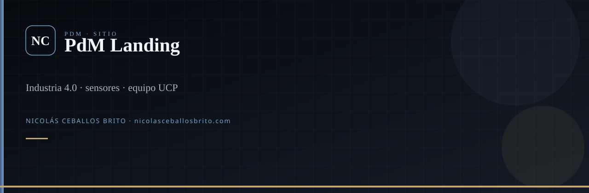

<div align="center">
  
</div>

<br />

<div align="center">

**Sitio estático del proyecto PdM** (UCP · Industria 4.0). No es el backend: es la cara del equipo y del problema.

[](https://developer.mozilla.org/)
[](https://getbootstrap.com/)

</div>

## Qué es

Landing informativa: sensores, ML, créditos del equipo, video. El sistema que clasifica vibraciones vive en [PdM-Manager](https://github.com/Nico2603/PdM-Manager).

## Stack

HTML · CSS · Bootstrap 5 · JS mínimo

## Ver local

```bash
git clone https://github.com/Nico2603/PdM_Landing-Page.git
cd PdM_Landing-Page
```

Abre `index.html` (o cualquier servidor estático). Páginas: `index.html`, `info.html`.

## Familia PdM

[Arduino-PdM](https://github.com/Nico2603/Arduino-PdM) · [PdM-Manager](https://github.com/Nico2603/PdM-Manager) · [Algoritmos ML](https://github.com/Nico2603/Algoritmos-de-ML-no-supervisados-para-PdM) · **esta landing**

## Agentes

`.agents/skills/` — Superpowers, `nicolas-identity`, `find-skills`, `frontend-design`. `graphify update .`

---

<div align="center">

**Nicolás Ceballos Brito** · Ingeniero en Sistemas y Telecomunicaciones (UCP 2025)  
CTO · Prosavis · Pereira, Colombia

[nicolasceballosbrito.com](https://nicolasceballosbrito.com)
·
[GitHub](https://github.com/Nico2603)
·
[LinkedIn](https://www.linkedin.com/in/nicolas-ceballos-brito/)
·
[X](https://x.com/NicolasCBrito)
·
[Instagram](https://www.instagram.com/nico_ceballos26/)
·
[Hugging Face](https://huggingface.co/Flackoooo)
·
[Email](mailto:nicolasceballosbrito@gmail.com)

</div>
